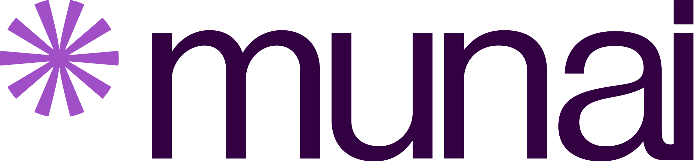

***
# Teste Técnico
## Desenvolvedor Back-End

### Introdução
Este teste é direcionado para profissionais que desejam atuar como desenvolvedor back-end na Munai. 

O processo seletivo prevê a contratação de 1 profissional para atuação em projetos de Integração e Interoperabilidade com diferentes clientes da Munai.

O teste consiste em 3 partes:
- Arquitetura: Configuração de servidor FHIR
- Integração de Dados: Carga de dados para o _Resource Patient_ e outros que se fizerem necessários
- Apresentação Técnica: Reunião online para apresentação da solução desenvolvida

Todos os artefatos e entregáveis produzidos deverão ser organizados em um repositório público no Github vinculado a sua conta pessoal.

O prazo para entrega do teste é de 7 dias corridos a partir da data de envio do mesmo por e-mail.

### Parte 1- Configuração de servidor FHIR (Arquitetura)
Primeiramente você deve preparar um servidor FHIR necessariamente no seu ambiente local (sem usar soluções _cloud_). Sugerimos que você utilize containers Docker devidamente configurados a partir de um arquivo Docker Composer. O servidor FHIR deve ser uma solução _Open Source_, como o [HAPI FHIR](https://hapifhir.io/) ou similar.

O entregável dessa parte é uma pequena documentação explicando o processo de instalação e configuração do servidor, além de outros artefatos como por exemplo:
- Arquivo Docker Composer
- Arquivo de configuração do servidor FHIR
- Arquivos PDF ou Markdown com o passo a passo realizado

### Parte 2 - Carga de dados para o _Resource Patient_ e outros que se fizerem necessários (Integração de Dados)
Após a configuração do servidor, agora você deve realizar a carga dos dados disponíveis em [data/patients.csv](data/patients.csv) para o _Resource Patient_ do servidor FHIR. Observe que há uma coluna chamada "observação" que contém informações adicionais sobre o estado de saúde do paciente, essas informações (quando existir) devem ser carregadas para o _Resource_ adequado.

Para isso, você pode usar qualquer ferramenta de sua preferência, como por exemplo:
- Mirth Connect
- Scripts Python
- Scripts com a linguem de programação preferencial
- Pentaho Data Integration
- Apache Nifi
- Apache Airflow

Ferramentas de Big Data como Spark, Kafka, ElasticSearch e outras também são bem vindas.

O entregável dessa parte são todos os artefatos produzidos para a carga dos dados, como scripts, códigos, arquivos de configuração entre outros.

**Bônus: A Rede Nacional de Dados em Saúde disponibiliza no Simplifier.net um _profile_ para o _Resource Patient_ com customizações para as necessidades nacionais. Realizar a carga dos dados utilizando esse _profile_ é um grande diferencial. Acesse pelo link https://simplifier.net/redenacionaldedadosemsaude/brindividuo**

### Parte 3 - Apresentação Técnica (Reunião online)
A última parte do teste é uma reunião online de até 30 minutos onde você deve apresentar a solução desenvolvida. Nessa reunião, você deve explicar o processo de configuração do servidor FHIR, a carga dos dados e esclarecer possíveis dúvidas.

Ao final do prazo de entrega do teste, envie o link do respositório com todos os entregáveis para o e-mail [debora.carvalho@munai.com.br](mailto:debora.carvalho@munai.com.br). Após o recebimento entraremos em contato para agendar a apresentação.